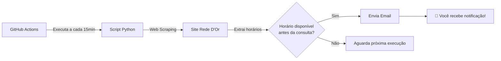

# 🏥 Monitor de Disponibilidade - Rede D'Or São Luiz


> Sistema automatizado para monitorar disponibilidade de consultas médicas e receber notificações por email quando houver horários disponíveis antes da sua consulta atual.

---

## 📑 Índice

- [Funcionalidades](#-funcionalidades)
- [Configuração Rápida](#-configuração-rápida)
- [Documentação Completa](#-documentação-completa)
- [Como Funciona](#-como-funciona)
- [Estrutura do Projeto](#-estrutura-do-projeto)
- [Personalização](#-personalização)
- [Limitações](#️-limitações)
- [Desenvolvimento](#-desenvolvimento)
- [Contribuindo](#-contribuindo)
- [Licença](#-licença)

---

## ✨ Funcionalidades

- ✅ **Verificação Automática**: Executa a cada 15 minutos via GitHub Actions (configurável)
- ✅ **Busca Inteligente**: Encontra horários de médica específica usando web scraping
- ✅ **Filtro por Data**: Compara com sua consulta já agendada
- ✅ **Notificações Email**: Envia email HTML formatado quando encontra horários anteriores
- ✅ **100% Gratuito**: Usa GitHub Actions (sem necessidade de servidor próprio)
- ✅ **Debug Automático**: Gera screenshots e HTML para troubleshooting
- ✅ **Type Safe**: Código com type hints e validações

---

## 🚀 Configuração Rápida

### Pré-requisitos

- Conta no GitHub (gratuita)
- Conta Gmail (para envio de notificações)

### Passo a Passo

1. **Fazer fork/upload deste repositório**
   ```bash
   # Via GitHub Web Interface ou
   git clone https://github.com/SEU_USUARIO/monitor-consulta-rededor.git
   ```

2. **Configurar Secrets no GitHub**
   
   Acesse: `Settings` → `Secrets and variables` → `Actions` → `New repository secret`
   
   | Secret | Valor |
   |--------|-------|
   | `EMAIL_SENDER` | seu-email@gmail.com |
   | `EMAIL_PASSWORD` | [Senha de app do Gmail](https://myaccount.google.com/apppasswords) |

3. **Editar configurações no código**
   
   Abra [`check_availability.py`](./check_availability.py) e edite:
   ```python
   NOME_MEDICA = "Nome da Médica"
   ESPECIALIDADE = "Especialidade"
   LOCAL_ATENDIMENTO = "Local"
   DATA_CONSULTA_ATUAL = "YYYY-MM-DD"
   EMAIL_DESTINO = "seu-email@exemplo.com"
   MEDICA_ID = "ID_DA_MEDICA"  # Obtido do site
   ```

4. **Ativar GitHub Actions**
   
   Vá em `Actions` → Enable workflows

5. **Testar**
   
   `Actions` → `Verificar Disponibilidade Consulta` → `Run workflow`

✅ **Pronto!** Você receberá emails quando houver horários disponíveis.

---

## 📖 Documentação Completa

Guias detalhados em [`docs/`](./docs/):

- 📘 [**Guia Rápido**](./docs/GUIA_RAPIDO.md) - Configuração passo a passo completa
- 🔧 [**Ajuste de Seletores**](./docs/GUIA_AJUSTE_SELETORES.md) - Como adaptar se o site mudar
- 📦 [**Como Fazer Upload**](./docs/COMO_FAZER_UPLOAD.md) - Instruções para criar repositório
- 🤝 [**Contribuindo**](./CONTRIBUTING.md) - Guia para desenvolvedores

---

## 🔍 Como Funciona



### Fluxo de Execução

1. **GitHub Actions** dispara o workflow automaticamente
2. **Script Python** acessa o site usando Playwright (navegador headless)
3. **Web Scraper** extrai horários disponíveis da página
4. **Filtro** compara datas e identifica horários anteriores à consulta agendada
5. **Notificador** envia email HTML formatado se encontrar horários
6. **Debug** gera screenshots e logs para troubleshooting

---

## 📁 Estrutura do Projeto

```
monitor-consulta-rededor/
├── .github/
│   └── workflows/
│       └── check_availability.yml  # Workflow do GitHub Actions
├── docs/                            # Documentação completa
│   ├── GUIA_RAPIDO.md
│   ├── GUIA_AJUSTE_SELETORES.md
│   └── COMO_FAZER_UPLOAD.md
├── check_availability.py            # Script principal
├── requirements.txt                 # Dependências Python
├── requirements-dev.txt             # Dependências de desenvolvimento
├── pyproject.toml                   # Configuração de ferramentas
├── .env.example                     # Template de variáveis de ambiente
├── .gitignore
├── LICENSE                          # MIT License
├── CONTRIBUTING.md                  # Guia de contribuição
├── CHANGELOG.md                     # Registro de mudanças
└── README.md                        # Este arquivo
```

---

## 🎨 Personalização

### Alterar Frequência de Verificação

Edite [`.github/workflows/check_availability.yml`](./.github/workflows/check_availability.yml):

```yaml
schedule:
  - cron: '*/15 * * * *'  # A cada 15 minutos (padrão)
  # - cron: '*/30 * * * *'  # A cada 30 minutos
  # - cron: '0 * * * *'     # A cada hora
  # - cron: '0 8-18 * * 1-5'  # Horário comercial (Seg-Sex, 8h-18h)
```

> [!TIP]
> Use [crontab.guru](https://crontab.guru/) para testar expressões cron

### Usar Outro Provedor de Email

No `check_availability.py`, altere as configurações SMTP:

```python
# Para Outlook/Hotmail
notifier = EmailNotifier(EMAIL_REMETENTE, SENHA_EMAIL, 'smtp-mail.outlook.com', 587)

# Para Yahoo
notifier = EmailNotifier(EMAIL_REMETENTE, SENHA_EMAIL, 'smtp.mail.yahoo.com', 587)
```

### Monitorar Múltiplos Médicos

Duplique o workflow e crie um arquivo para cada médico, ou modifique o script para aceitar lista de configurações.

---

## ⚠️ Limitações

### GitHub Actions (Plano Gratuito)

| Recurso | Limite |
|---------|--------|
| Minutos/mês | 2.000 |
| Cada execução | ~2 min |
| Execuções/dia (15min) | ~192 |
| Consumo mensal estimado | ~11.520 min ⚠️ |

> [!WARNING]
> **Solução**: Limitar execuções para horário comercial ou aumentar intervalo:
> ```yaml
> cron: '*/15 8-18 * * 1-5'  # Apenas Seg-Sex, 8h-18h
> ```

### Gmail

- Limite de 500 emails/dia (suficiente para este uso)

### Web Scraping

- Sites podem mudar estrutura HTML → Necessário ajustar seletores
- Ver [Guia de Ajuste de Seletores](./docs/GUIA_AJUSTE_SELETORES.md)

---

## 🛠️ Desenvolvimento

### Configurar Ambiente Local

```bash
# Clone o repositório
git clone https://github.com/SEU_USUARIO/monitor-consulta-rededor.git
cd monitor-consulta-rededor

# Crie ambiente virtual
python -m venv venv
source venv/bin/activate  # Linux/Mac
# venv\Scripts\activate    # Windows

# Instale dependências
pip install -r requirements.txt
pip install -r requirements-dev.txt
playwright install chromium

# Configure variáveis de ambiente
cp .env.example .env
# Edite .env com suas credenciais
```

### Executar Localmente

```bash
# Configurar variáveis
export EMAIL_SENDER="seu-email@gmail.com"
export EMAIL_PASSWORD="sua-senha-app"

# Executar
python check_availability.py
```

### Ferramentas de Desenvolvimento

```bash
# Formatar código
black check_availability.py

# Lint
ruff check check_availability.py

# Type check
mypy check_availability.py

# Testes (quando disponíveis)
pytest --cov=. --cov-report=html
```

---

## 🤝 Contribuindo

Contribuições são bem-vindas! Por favor, leia [CONTRIBUTING.md](./CONTRIBUTING.md) para detalhes sobre:

- Como reportar bugs
- Como sugerir melhorias
- Padrões de código
- Processo de pull request

### Áreas que Precisam de Ajuda

- [ ] Testes unitários
- [ ] Suporte para outros sites de agendamento
- [ ] Dashboard web para histórico
- [ ] Notificações via Telegram/WhatsApp

---

## 🐛 Solução de Problemas

### Email não está sendo enviado

1. ✅ Verifique se secrets estão configurados corretamente
2. ✅ Confirme que está usando **senha de aplicativo** (não senha normal)
3. ✅ Verifique logs no GitHub Actions para mensagens de erro

### Script não encontra a médica

1. 📸 Baixe screenshots de debug (Actions → Artifacts)
2. 🔧 Ajuste seletores CSS conforme [guia](./docs/GUIA_AJUSTE_SELETORES.md)
3. 🧪 Teste localmente antes de fazer commit

### Workflow não executa

1. ⚙️ Verifique se Actions está ativado (Actions → Enable workflows)
2. 📝 Verifique sintaxe do arquivo `.yml`
3. 🔍 Repositório deve ter pelo menos 1 commit

---

## 📧 Exemplo de Email Recebido

Quando horários são encontrados, você recebe um email assim:

<details>
<summary>Ver exemplo de email (clique para expandir)</summary>

```
🎯 Horário(s) Disponível(is) Encontrado(s)!

Médica: Isadora Leda Braga
Especialidade: Endocrinologia Geral
Local: Hospital Villa Lobos
Sua consulta atual: 2026-03-11

📅 Horários disponíveis ANTES da sua consulta:
• 20/02/2026 às 14:30
• 25/02/2026 às 10:00
• 03/03/2026 às 16:45

⚡ Acesse o site rapidamente para fazer a marcação!
[Marcar Consulta Agora]
```

</details>

---

## 📜 Licença

Este projeto está licenciado sob a Licença MIT - veja o arquivo [LICENSE](LICENSE) para detalhes.

```
MIT License - Copyright (c) 2026 Alan Nascimento
```

---

## 🙏 Agradecimentos

- [Playwright](https://playwright.dev/) - Automação de navegador
- [GitHub Actions](https://github.com/features/actions) - CI/CD gratuito
- Comunidade Python 🐍

---

## ⭐ Gostou do Projeto?

Se este projeto foi útil para você:

- ⭐ Dê uma estrela no repositório
- 🐛 Reporte bugs ou sugira melhorias
- 🤝 Contribua com código ou documentação
- 📢 Compartilhe com amigos que possam se beneficiar

---

<div align="center">

**Feito com ❤️ para facilitar agendamentos médicos**

[Reportar Bug](../../issues) · [Sugerir Feature](../../issues) · [Documentação](./docs/)

</div>
